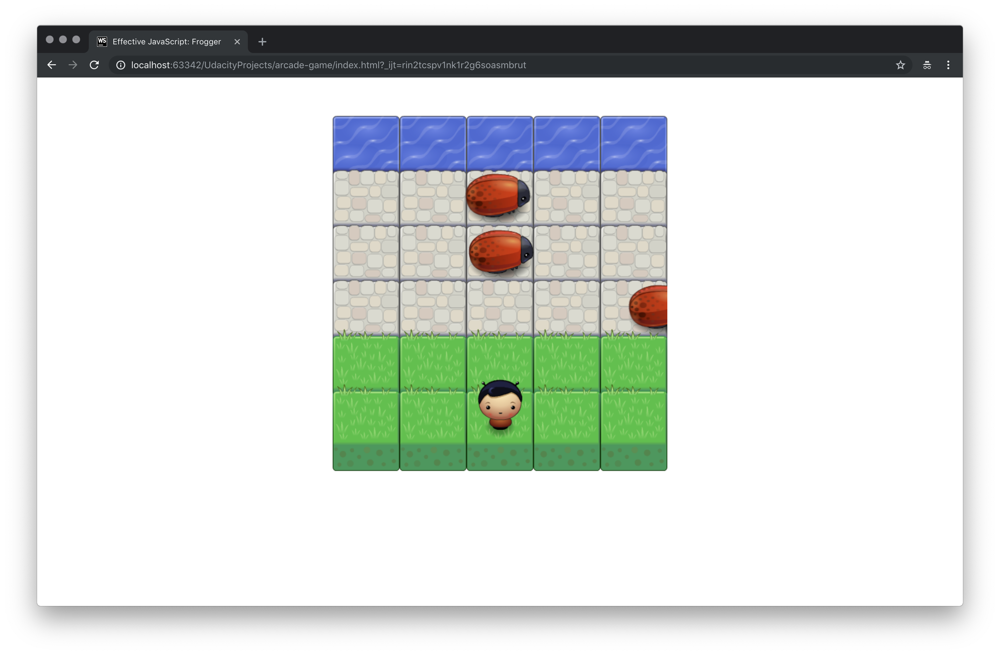

# Arcade Game Project
---

### Overview

This **Arcade Game** is one of the Udacity Front End Developer Nanodegree Projects.

#### Focus
* Javascript

The goal of this game is reach to the water area which is the top part of the panel. 
The player starts at the bottom center and can use direction keys (up, right, down and left) to control the character.
There are 3 enemies in the game and they are always roaming.

#### Features
* Player can only roam around within the panel
* Enemies can roam at different speed
* If the character collides with any enemy it will go back to the starting point
* When player reaches to the water area then the player wins and will go back to the starting point

### Getting Started
1. Please download/clone this folder/repo
2. Please find and open the index.html file
3. The game will start automatically

