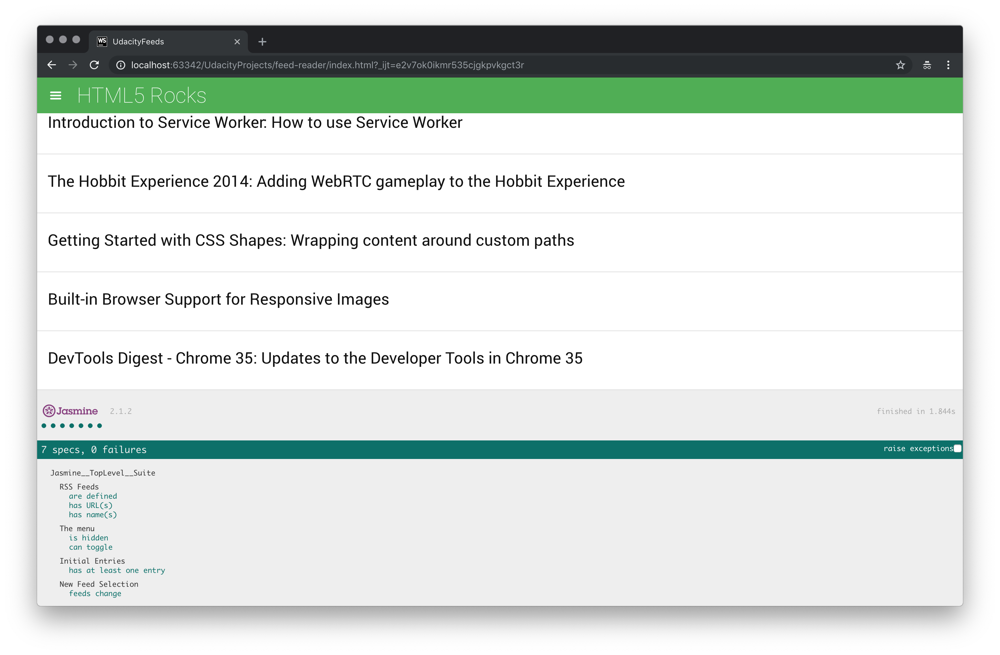

# Feed Reader Testing Project
---

### Overview

This is a web-based application that reads RSS feeds. The focus is utilizing Jasmine to do testing for the application.

#### Focus
* Unit Testing

#### Features
* Feed Reader Page
    * Checking feeds emptiness.
    * Checking menu toggle function.
    * Checking feeds are loaded correctly.
    * Checking feeds do change.

### Getting Started
1. Please download/clone this folder/repo
2. Please find and open the index.html file
3. The testing result will show up at the bottom
