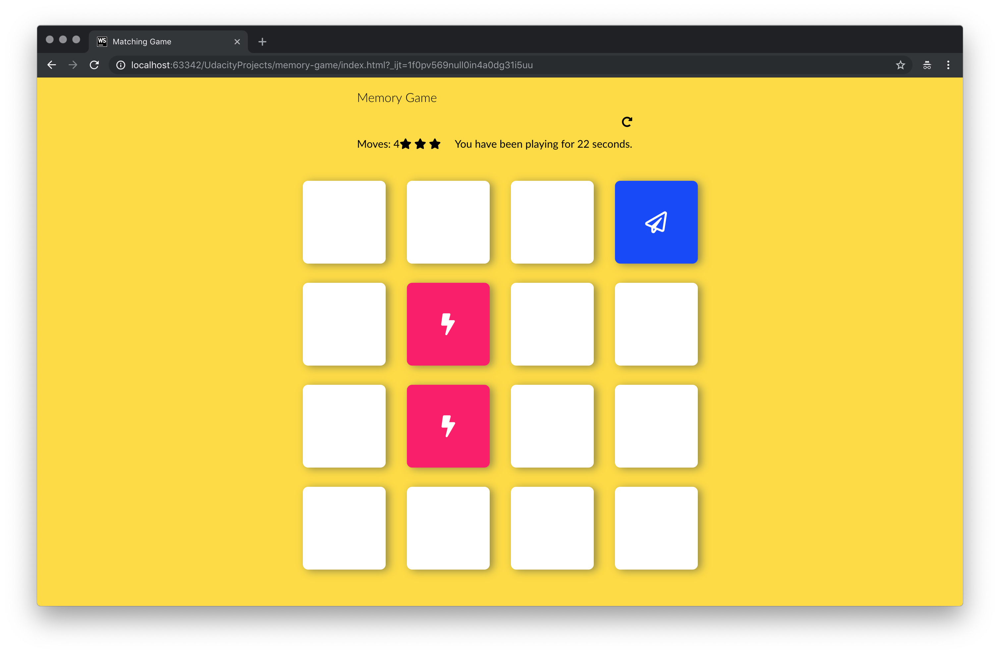
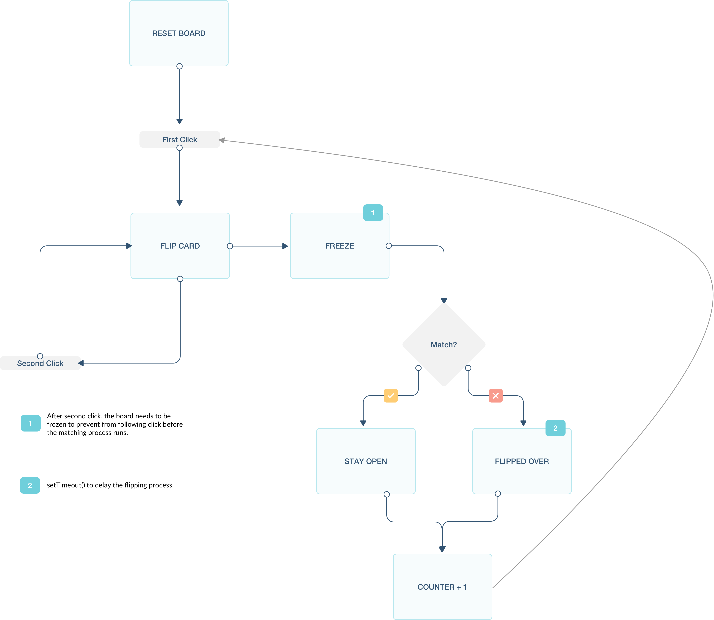

# Memory Game Project
---

### Overview

This **Memory Game** is one of the Udacity Front End Developer Nanodegree Projects. It is a mobile-ready web application. 

##### Focus
* Javascript
* Mobile Friendly

##### Features
* Game Page
    * The game contains 8 pairs of image icons
    * The game has a timer to capture how long the game runs
    * The game has a score system which is based on how many clicks that user has used to finish the game
    * The game has a reset button to restart the game
    * You win the game with all cards are flipped
    
#### Flowchart

### Getting Started
1. Please download/clone this folder/repo
2. Please find and open the index.html file
3. To start game, please click on any cards. At the same time, a timer will start counting.
